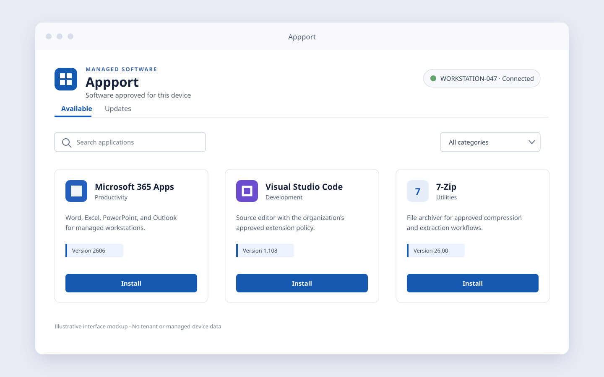

# Appport

Appport is a self-service software catalog for managed Windows 11 devices. It
runs as a Tauri desktop application and shows the Windows applications and
updates authorized for the current user and device in Relution.

The React WebView is network-isolated. Native Rust code owns authentication,
Relution requests, device matching, action safety, Windows integration, and
local persistence.



The mockup contains no tenant or managed-device data and is not release
evidence.

## Repository layout

    apps/windows-client/  Tauri, Rust, React, and Vite client
    docs/                 Product, development, operations, and release documentation
    scripts/              Source verification and release-evidence tooling

## Requirements

- Node 26.5.x
- pnpm 11.6.0
- Rust 1.96.0 with Clippy and rustfmt
- Windows 11 x64 with the MSVC toolchain for MSI builds

Install dependencies and run the complete deterministic source gate:

```sh
pnpm install --frozen-lockfile
pnpm verify:source
```

For frontend-only work, `pnpm --dir apps/windows-client dev` starts Vite without
compiling Rust or contacting Relution. Run
`pnpm --dir apps/windows-client tauri dev` only on a configured Windows host.

Alpha.4 qualification builds use a fixed approved tenant and an explicit
compile-time profile. They are unsigned and non-distributable. See the
[configuration guide](docs/CONFIGURATION.md) and
[release checklist](docs/RELEASE_CHECKLIST.md) before building or qualifying a
candidate.

## Documentation

- [Product principles](docs/PRODUCT.md)
- [Architecture](docs/ARCHITECTURE.md)
- [Configuration](docs/CONFIGURATION.md)
- [Development](docs/DEVELOPMENT.md)
- [Native Windows client](docs/NATIVE_WINDOWS_CLIENT.md)
- [Operations](docs/OPERATIONS.md)
- [Release checklist](docs/RELEASE_CHECKLIST.md)
- [Current release status](RELEASE_STATUS.md)
- [Alpha.4 release notes](docs/releases/0.1.0-alpha.4.md)
- [Security policy](SECURITY.md)
