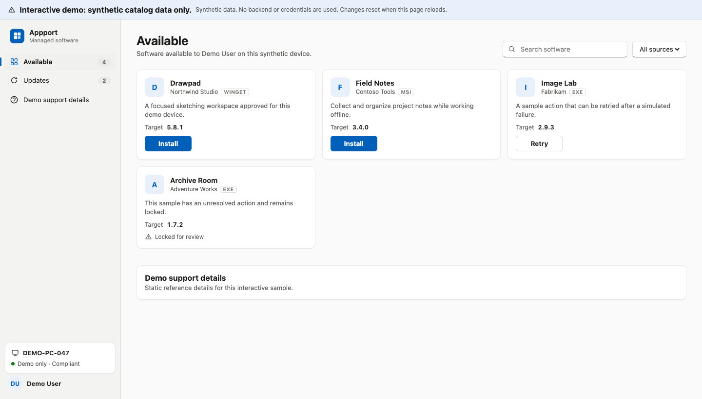
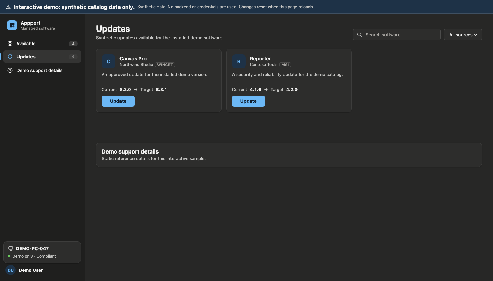
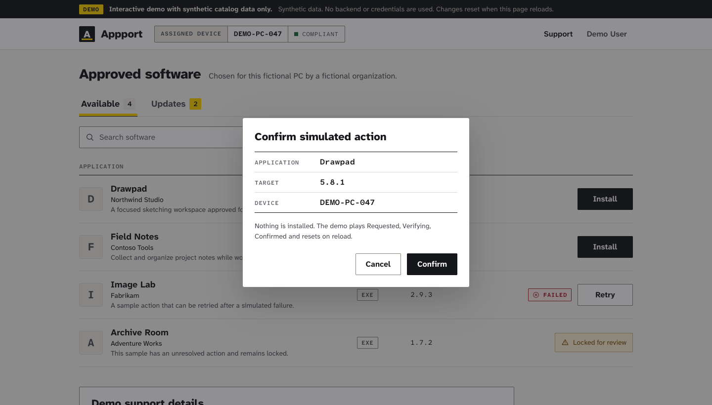
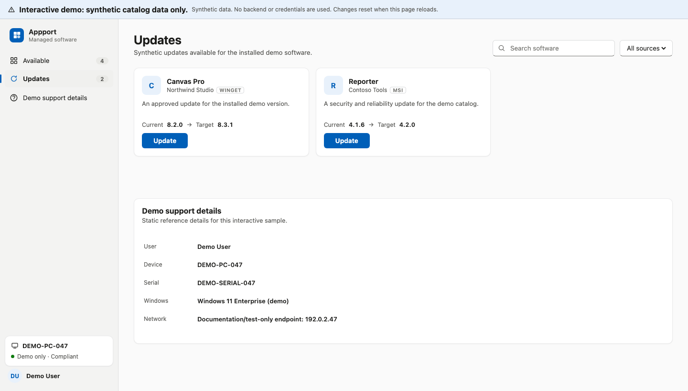

# Appport

Appport is a software catalog for Relution-managed Windows 11 PCs. Users can find
applications they have permission to install on their assigned device and request
installs or updates. Relution handles the deployment.

[Browser demo](https://sebastianspicker.github.io/appport/) ·
[Run locally](#try-it-locally) ·
[Documentation](#documentation)

Try the interface in your browser without an account. The demo uses fictional
software, users, and devices; its actions install nothing and reset when you reload
the page. If the hosted demo is unavailable, use the local commands below or see
[GitHub Pages setup](apps/web-demo/README.md#github-pages).

## Screenshot tour

These screenshots show the running browser demo in Chromium. The demo and Windows
client use separate code, so the tour illustrates the interface rather than native
Windows behavior.

### Find software

Available lists software to install. Search by name or publisher, or filter by
package source. The examples include a failed request you can retry and an
unresolved request that stays locked for review.



### Review updates

Updates puts the installed and target versions next to each other. The demo
follows your system's light or dark theme.



### Confirm a request

Install and Update ask for confirmation. In the demo, confirming starts a short
simulation on the four-stage request track: Queued, Verifying installation, then
Succeeded.



### Find device details

Expand Demo support details to see the fictional user, PC, and Windows information.
The Windows client can also create a local support ZIP after the user confirms;
the browser demo creates no files.



See [screenshot notes](docs/assets/screenshots/README.md) for capture settings and
refresh instructions.

## Project status

The current version is `0.1.0-alpha.4`. This alpha is intended for testing; Windows
builds are unsigned and not ready for distribution. [Release status](RELEASE_STATUS.md)
lists the Windows and live Relution checks still needed.

Each Windows build is configured for one Relution organization, with its server
origin, organization UUID, and Appport application UUID set at build time. The
source can be configured for different organizations; the running client cannot
switch between them. Appport specifically targets Relution and Windows.

The project does not yet have a license permitting reuse or redistribution.

## Try it locally

Install Node.js 26.5.x and pnpm 11.6.0, then run these commands from the repository
root:

```sh
pnpm install --frozen-lockfile
pnpm demo:build
pnpm --dir apps/web-demo exec vite preview --host 127.0.0.1
```

Open the address printed by Vite. This serves the same browser build used for
GitHub Pages. You do not need Windows, Rust, or a Relution account to try it.

Run the demo's checks with:

```sh
pnpm demo:verify
```

## Work on the Windows client

The desktop app uses React, Tauri 2, and Rust. React renders the interface. Rust
handles personal-token sign-in, Relution requests, device matching, Windows
integration, and local state. A deployment is reported as successful only after
Relution inventory confirms the expected package and version.

Use Rust 1.96.0 with Clippy and rustfmt alongside Node.js and pnpm. Running the
native app or building an MSI requires Windows 11 x64 and the MSVC toolchain.
[Development](docs/DEVELOPMENT.md) covers setup and tests;
[Configuration](docs/CONFIGURATION.md) lists the build inputs.

Run the full source checks with:

```sh
pnpm verify:source
```

This checks the desktop frontend, portable Rust code, architecture, documentation,
and build-verification tools. Run `pnpm demo:verify` separately for the demo.
Windows integration and live Relution testing are covered in
[Operations](docs/OPERATIONS.md).

| Directory | Contents |
| --- | --- |
| [`apps/windows-client`](apps/windows-client/README.md) | Windows app and command-line qualification utility |
| [`apps/web-demo`](apps/web-demo/README.md) | Browser demo with fictional data |
| `scripts` | Repository checks and qualification evidence tools |
| `docs` | Architecture, setup, operations, and release notes |

## Documentation

- [Architecture](docs/ARCHITECTURE.md): components and request flow
- [Development](docs/DEVELOPMENT.md): setup, commands, and tests
- [Configuration](docs/CONFIGURATION.md): build inputs, credentials, and diagnostics
- [Operations](docs/OPERATIONS.md): Windows builds and qualification
- [Contributing](CONTRIBUTING.md): preparing a pull request
- [Security](SECURITY.md): reporting a vulnerability
- [Alpha.4 release notes](docs/releases/0.1.0-alpha.4.md)
