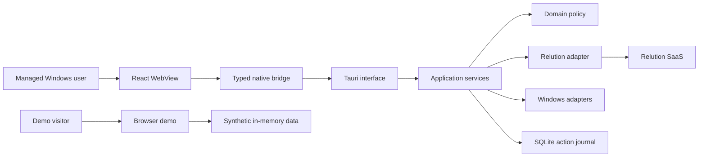
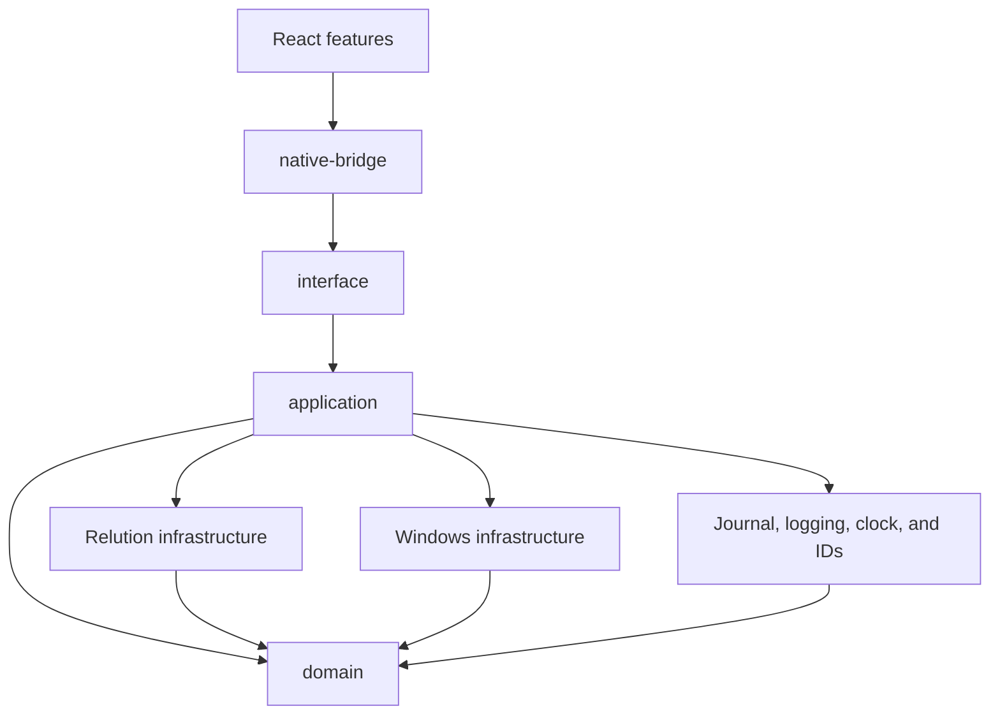

# Architecture

Appport is a Windows desktop application for finding and requesting software from
Relution. The client shows software that a user may install or update, sends the
request to Relution, and follows the resulting deployment. Relution remains the
source of truth for users, devices, permissions, inventory, action history, and
deployments. Appport never runs an installer directly.

The repository also includes a public browser demo. It resembles the desktop UI,
but runs entirely from synthetic fixtures and in-memory state. It has its own source
tree and build.

The desktop WebView and browser demo both use a content security policy with
`connect-src 'none'`. All product network requests come from native Rust and go to
the single HTTPS Relution origin embedded during the build.

## Repository layout

| Path | What belongs there |
| --- | --- |
| `apps/windows-client/src/app` | Desktop composition and feature hooks |
| `apps/windows-client/src/catalog` | Available and Updates views, application rows, confirmation dialogs, and action status |
| `apps/windows-client/src/session` | Personal-token sign-in and local sign-out UI |
| `apps/windows-client/src/support` | Device details and support-bundle consent UI |
| `apps/windows-client/src/native-bridge` | The only TypeScript code that imports Tauri APIs |
| `apps/windows-client/src-tauri/src/interface` | Command decoding, runtime setup, serialized models, and error mapping |
| `apps/windows-client/src-tauri/src/application` | Session, catalog, action, background, and support workflows |
| `apps/windows-client/src-tauri/src/domain` | Side-effect-free catalog, action, and device rules |
| `apps/windows-client/src-tauri/src/infrastructure/relution` | Relution HTTP transport, pagination, limits, and DTO conversion |
| `apps/windows-client/src-tauri/src/infrastructure/windows` | Credentials, device discovery, scheduled tasks, notifications, protocol registration, portal access, and support files |
| `apps/windows-client/src-tauri/src/infrastructure/journal.rs` | Durable per-user action reservations and reconciliation state |
| `apps/windows-client/src-tauri/src/qualification` | Installed candidate self-checks and live Relution tests |
| `apps/web-demo` | Independent browser demo with synthetic data |
| `scripts/alpha-evidence` | Candidate artifact and configuration checks |

## Native design

Native dependencies flow from `interface` to `application` to `domain`.
Infrastructure turns Relution and Windows data into domain values before any policy
decision is made. Application services call concrete adapters because the product
is specifically built for Relution and Windows.

The domain stays independent of Tauri, HTTP, Windows, SQLite, application services,
and serialized command models. The Relution adapter handles transport and DTO
conversion. Catalog caching, permission orchestration, deployment policy, journal
transitions, and Tauri response models live in their respective higher-level
modules.

Tauri commands remain small: they decode input, call an application service, and
serialize the result. Any command change must be reflected in the Rust handler,
`apps/windows-client/native-contract.json`, the TypeScript bridge, and the contract
tests. Existing camelCase and snake_case wire fields are compatibility contracts.

## Signing in and loading the catalog

The user enters a username and personal token in the masked sign-in form. Native
code resolves exactly one active user in the embedded Relution organization, then
stores the session in Windows Credential Manager as `Relution/Appport/v1`.

To build the catalog, Appport:

1. collects stable identifiers for the local Windows device;
2. finds exactly one active assigned Relution device that matches those identifiers;
3. loads supported, released applications and checks direct and recursive group
   `RELEASE` permissions;
4. removes the application identified by `APPPORT_NATIVE_APP_UUID`; and
5. compares eligible applications with the matched device inventory.

Only Available and Update Available applications reach the UI. Installed-current
applications remain an internal classification.

`load_catalog` returns bootstrap counts, rows for the requested view, and one opaque
`catalogRevision` from the same snapshot. The compatibility commands `bootstrap`
and `list_apps` use the same service. A snapshot is tied to the current credential
generation and locale, and expires after 60 seconds on a monotonic clock. Moving
between views refreshes expired data. Refresh and retry always revalidate. Concurrent
refreshes share the same work, and a failed refresh does not reuse expired data.
The foreground application does not refresh on a timer.

During refresh, independent catalog, group, and device requests run concurrently.
Inventory loads after the device match. Permission checks process up to four
applications at a time and reuse group-membership results. Permission checks fail
closed.

Icons load shortly before their rows enter the viewport. Duplicate requests share a
result, with no more than four requests active at once. Native and frontend icon
caches are each capped at 32 MiB and 256 entries. A session or catalog change makes
older results ineligible for display. Restoring saved action state also uses a
four-request limit.

## Install and update requests

The action service follows this sequence:

1. Reject the request unless writes were enabled in the build.
2. Reload the requested application, its permissions, assigned devices, device
   inventory, and remote actions. A permission failure for an unrelated application
   does not stop this check.
3. Create a credential-free request containing the identifiers, requested action,
   and the current remote-action correlation state. Confirm that the credential
   generation is still current, then reserve one local action for the device and
   application.
4. Send one deployment POST to Relution. The read retry policy is never applied to
   this request.
5. Follow the Relution action and verify the exact package identity and target
   version in inventory before returning success.

Missing, ambiguous, and timed-out outcomes end in the non-retryable `unknown` state.
The journal's internal `Reserved` state is shown in the UI as `queued`.

The catalog and action services share a process-level SQLite journal in WAL mode.
A unique index prevents two active reservations for the same device and application,
and compare-and-set transitions protect the action state machine. SQLite waits up to
five seconds for a busy database. At startup, a process that owns the foreground
singleton changes interrupted reservations to `unknown`; it never assumes that they
succeeded and never resends them. Windows SID and access-control checks protect the
journal and its sidecar files. Path validation rejects symlinks and reparse points.

Once a deployment or support-bundle write starts, sign-out waits for it to finish.
Closing a frontend request cannot retract a deployment already sent to Relution.
Credential-generation checks also prevent a result from an older sign-in appearing
in a newer session.

## Windows background behavior

At startup, Appport registers the `relution-appport://` protocol and acquires a
foreground singleton. After sign-in, it attempts to create a least-privilege,
per-user scheduled check. A background run opens the stored session, loads the
catalog, and notifies the user only about update keys it has not seen before. These
keys are deterministic, opaque hashes of the application and version, stored in the
current-user registry.

## Support bundles

The Support view loads a bounded set of device and connection details on demand.
After the user confirms the request for the current session, native code writes one
size-limited ZIP to a fixed directory for the current user. Appport does not upload
the ZIP. Credentials, raw Relution responses, inventory, the action journal, and
user-selected paths are excluded.

## Qualification utility

`relution-appport-qualification` is a separate executable built from the same Rust
crate. It uses the same catalog and action services as the desktop application and
keeps its own journal. Tokens are read from masked console input.

The `read_only` profile checks expected denials and read behavior. The
`write_qualification` profile also performs planned actions against disposable
resources and verifies cleanup. Its report identifies the MSI, qualification
utility, embedded configuration, and source revision by digest or fingerprint.

## Stored state

- Relution stores remote identity, authorization, inventory, actions, and deployment
  state.
- Windows Credential Manager stores the per-user session. Signing out removes the
  local record; token revocation remains a Relution operation.
- SQLite stores action recovery and correlation metadata. Tokens are never written
  to the journal.
- The current-user registry stores scheduled-check and update-notification state.
- Fixed current-user directories hold bounded logs and support bundles. Windows ACL
  checks and reparse-point detection protect access to these files.

HTTP response bodies, page counts, and icons all have explicit limits. The transport
rejects redirects and request paths that would escape the embedded Relution origin.

## Build and packaging

The Relution origin, organization UUID, Appport application UUID, qualification
profile, write setting, diagnostics setting, and source revision are compile-time
inputs. The Windows product is packaged as one MSI. The qualification utility is a
separate executable from the same Rust crate. Passing source checks, producing a
candidate MSI, and completing tests against a Relution tenant are three distinct
results.

The browser demo builds to `apps/web-demo/dist`, and its GitHub Pages workflow
uploads only that directory. It does not authenticate, persist data, call native
commands, or simulate a Relution tenant.

Appport has no runtime endpoint or profile selector, local network service, direct
installer execution, user-selectable support path, or Relution application uninstall
action. Supported authentication is limited to personal tokens; Basic authentication,
portal cookies, HTML login, administrative credentials, and technical accounts are
outside the current product.

See [Configuration](CONFIGURATION.md), [Development](DEVELOPMENT.md), and
[Operations](OPERATIONS.md) for build, test, and qualification instructions.
